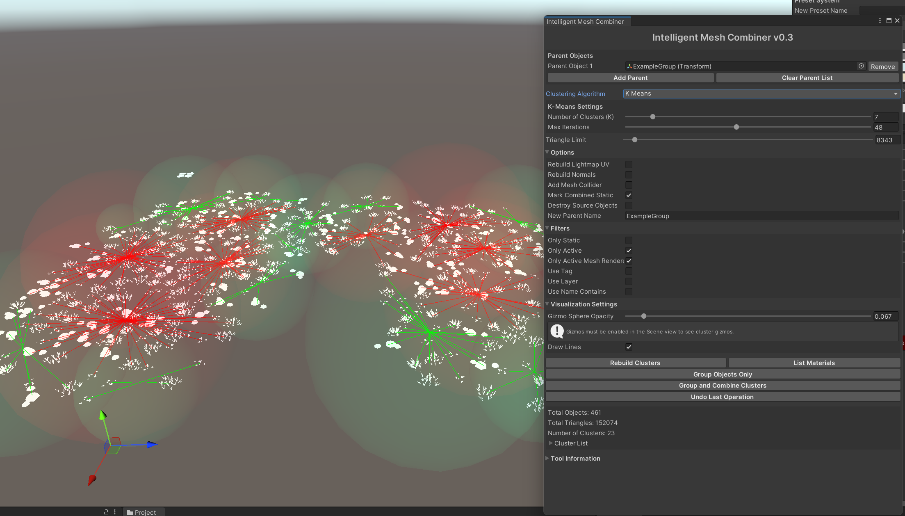

# Intelligent Mesh Combiner for Unity

Intelligent Mesh Combiner is a powerful Unity Editor tool designed to optimize your scenes by intelligently grouping and combining meshes based on their proximity and materials. This tool offers a sophisticated approach to reducing draw calls while preserving the visual fidelity and spatial relationships of your Unity scenes.

## Features

- Two clustering algorithms: Proximity-based and **K-means** 
- Adaptive cluster sizes that respect scene layout
- Automatic handling of multiple materials
- Creation of subgroups for clusters exceeding a specified triangle limit
- Visualization of clusters with material-specific colors for main groups
- Adjustable gizmo sphere opacity and scale for better visualization
- Saving of combined meshes as assets in an 'IMC_Meshes' folder
- **Filters** for selective combining: based on active state, static state, tags, layers, or name patterns
- Option to rebuild lightmap UVs for combined meshes
- Option to add mesh colliders to combined objects
- Marking of combined objects as static
- Option to destroy source objects after combining

## Quick Start and Installation

[Download Unity Package](https://github.com/roundyyy/intelligent_mesh_combiner/releases)

or

1. Clone or download this repository.
2. Copy the `IntelligentMeshCombiner.cs` file into your Unity project's `Editor` folder.
   - If you don't have an `Editor` folder, create one in your project's Assets directory.
3. The tool will appear in Unity under "Tools > Roundy > IntelligentMeshCombiner" in the top menu.

## Clustering Algorithms

### 1. Proximity-Based Clustering

- Groups objects based on their physical proximity within a specified radius
- Ideal for scenes with organically distributed objects
- Parameters:
  - **Grouping Radius**: Controls the maximum distance between objects in a cluster
  - **Subgroup Radius**: Defines the radius for creating smaller clusters within large groups

### 2. **K-Means Clustering** 

- Groups objects using the K-means algorithm, which aims to partition n observations into k clusters
- Suitable for scenes where you want more control over the number of resulting clusters
- Parameters:
  - **Number of Clusters (K)**: Specifies the desired number of clusters
  - **Max Iterations**: Controls the maximum number of iterations for the K-means algorithm

Both algorithms respect material boundaries, ensuring that only objects with the same material are grouped together.

## Filters

You can fine-tune which objects are included in the clustering process using various filters:

- **Static Only**: Include only objects marked as static
- **Active Only**: Include only active objects in the scene
- **Active Mesh Renderers Only**: Filter out inactive mesh renderers
- **Tag Filtering**: Filter objects based on their tag
- **Layer Filtering**: Filter objects based on their layer
- **Name Contains**: Filter objects whose name contains a specific string

## How to Use

1. Open the IntelligentMeshCombiner window by selecting "Tools > IntelligentMeshCombiner" from the Unity menu.

2. In your scene, select a parent object containing the meshes you want to group and combine.

3. In the IntelligentMeshCombiner window:
   - Assign the selected parent object to the "Parent Object" field.
   - Choose between Proximity-Based and **K-Means clustering algorithms**.
   - Adjust the parameters for your chosen algorithm:
     - For Proximity-Based: Set the "Grouping Radius" and "Subgroup Radius"
     - For K-Means: Set the "Number of Clusters (K)" and "Max Iterations"
   - Set the "Triangle Limit" to control when subgroups are created.
   - Configure additional options like rebuilding lightmap UVs, adding mesh colliders, etc.
   - Set filters as needed (e.g., static objects, active only, tag/layer filtering).

4. Click "Rebuild Clusters" to analyze the objects and visualize the groupings in the scene view.
   - Main groups will be displayed as colored spheres, with subtle variations for different materials.
   - Subgroups will appear as green spheres.
   - Groups exceeding the triangle limit will be shown in red.

5. Review the cluster information and adjust settings if needed.

6. Choose an action:
   - Click "Group Objects Only" to organize objects without combining meshes.
   - Click "Group and Combine Clusters" to both group and combine meshes.

7. The tool will create new combined objects and save the combined meshes as assets in the 'IMC_Meshes' folder within your project's Assets directory.

## LOD Handling

The Intelligent Mesh Combiner tool provides flexible handling for objects with and without LOD (Level of Detail) groups. You can choose between two options depending on your needs:

1. **Combine LODs Separately**
- When this option is selected, objects with LOD groups are combined separately from objects without LOD groups. This ensures that the integrity of LOD objects is maintained, and they are not merged with non-LOD objects.

2. **Combine All**
- This option merges objects without LOD groups into LOD groups. This can be useful when you want to consolidate all objects, including non-LOD objects, into a unified set of clusters that preserve the LOD functionality.

### How to Use
1. Select the parent objects containing the meshes.
2. Choose an LOD handling option:
   - **Combine LODs Separately**: Separate LOD group objects from non-LOD objects.
   - **Combine All**: Include non-LOD objects in the LOD groups.
3. Click **Rebuild Clusters** to analyze the objects based on your LOD handling selection.
4. Review the LOD and non-LOD clusters in the scene view to ensure that the objects are grouped as expected.

## Advantages Over Cell-Based Grouping

IntelligentMeshCombiner offers several advantages over traditional cell-based grouping methods:

1. **Adaptive Clustering**: Unlike fixed-size cells, our algorithms adapt to the natural distribution of objects in your scene. This results in more logical and visually coherent groupings.

2. **Material Awareness**: The tool respects material boundaries, ensuring that only objects with the same material are combined. This preserves the visual integrity of your scene while still optimizing performance.

3. **Flexible Grouping Sizes**: With the proximity-based algorithm, you can easily adjust the grouping radius to suit different areas of your scene. Dense areas can have smaller radii, while sparse areas can use larger radii.

4. **Controlled Cluster Count**: The K-means algorithm allows you to specify exactly how many clusters you want, giving you precise control over the level of optimization.

5. **No Arbitrary Boundaries**: Cell-based methods can create arbitrary splits at cell boundaries, potentially separating objects that should logically be grouped. Our algorithms avoid this issue by considering the actual spatial relationships between objects.

6. **Hierarchical Subgrouping**: The tool can create subgroups within larger clusters, allowing for more nuanced optimization that respects both large-scale and small-scale object relationships.

7. **Visual Feedback**: The gizmo visualization allows you to see and fine-tune your groupings before committing to changes, something not typically available with cell-based methods.

## Tips

- Experiment with both clustering algorithms to see which works best for your specific scene layout.
- Use the gizmo visualization options to fine-tune your clustering results before combining.
- For scenes with varied object density, the Proximity-Based algorithm might yield more natural groupings.
- If you have a specific number of groups in mind, the K-Means algorithm allows you to set this directly.
- Always make a backup of your scene before performing large-scale mesh combining operations.
- For large scenes, consider combining meshes in sections rather than all at once.
- Pay attention to the material-specific colors in main groups to ensure objects are being grouped as expected.

## TO DO

= Speed it up. Too slow when combining lot of objects same time (due to clustering algorithms)

## Limitations

- Objects with different materials cannot be combined into a single mesh.
- Skinned meshes are not supported for combination.
- Particle systems and other non-mesh renderers are ignored.

